# Gmail Email Identifer

A Google App Script Add-On for Gmail that helps user identify dangerous emails.

## Installation and Configuration

### AppScript Setup

1. Go to [Google Appscript](https://www.google.com/script/start/) and login with your Workspace account that has Administrative permissions.
2. Create a New Project
3. Copy the contents of [Code.gs](Code.gs) into the new project.
4. Click the save.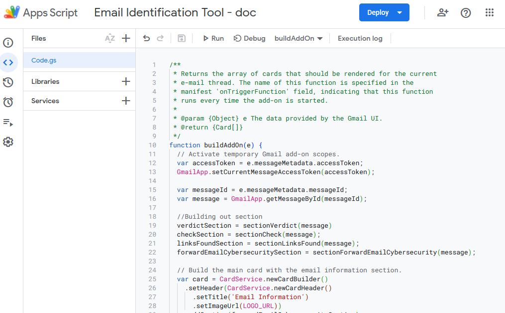
5. Add a new script file to the folder. Name the file config.gs, and copy the contents of [config.example.gs](config.example.gs) into this file.
6. Go to the Gear on the left panel, and check the box for *Show "appscript.json" manafest file in editor*
7. Then copy the [appscript.json](appsscript.example.json) into the appscript.json file in your editor. 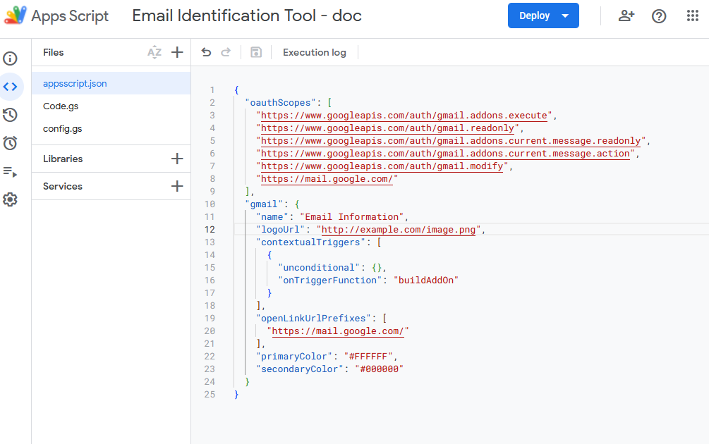

**STOP HERE FOR NOW, Go to Cloud Console Setup**

8. Go to the Gear on the left hand side
9. Select the "Change Project" button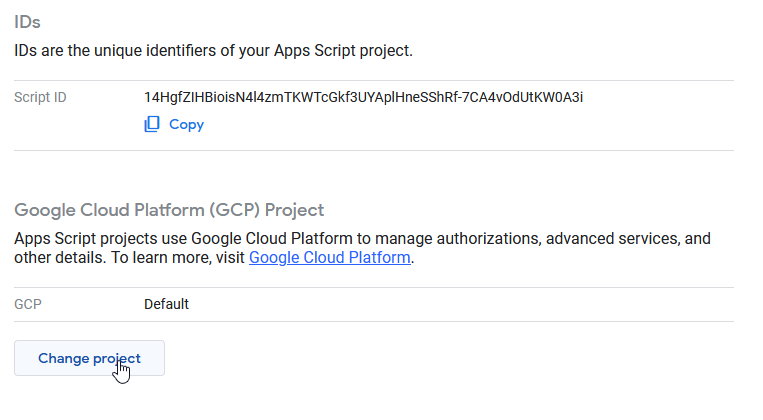
10. Paste in the Project Number you copied from the console.
11. Select Set Project
12. Click Deploy, New Deployment
13. Type in a description, such as "Production" or "Test", then select Deploy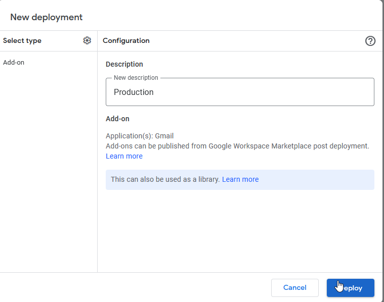
14. Copy the Deployment ID, we will need this for step 16 in the Console Setup

### Cloud Console Setup

Now that we have the script in place, we have to set up the connection so it will work with your workspace. 

1. Login to Your [Google Cloud Console](https://console.cloud.google.com/)
2. Create a New Project 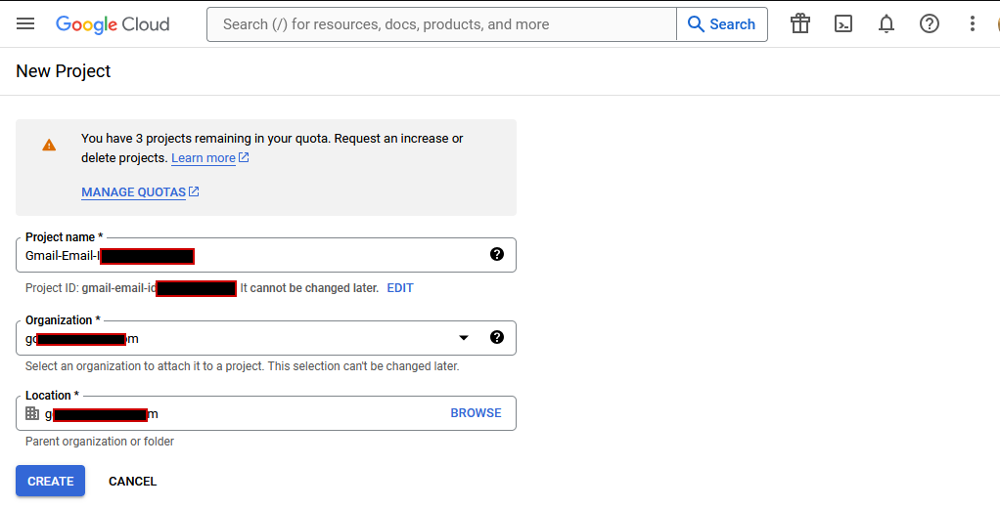
3. Copy the Project Number, we will need this for the App Script Deployment.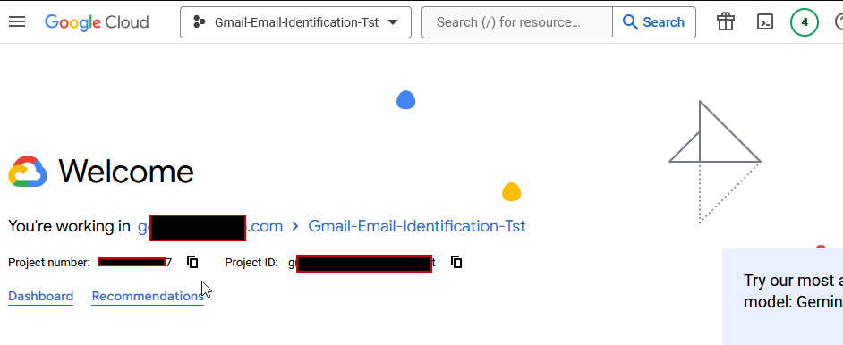

4. Click on "APIs & Services"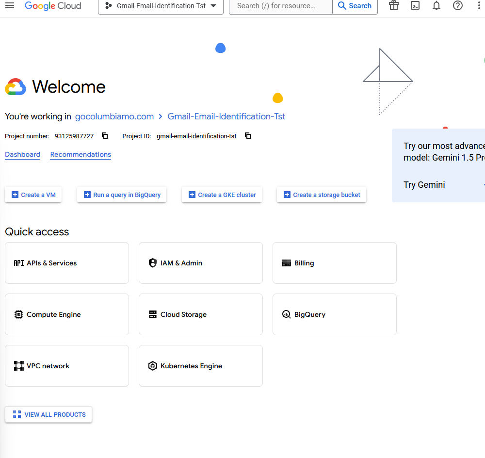
5. Click on + ENABLE APIS AND SERVICES
6. Enable the following
   * Gmail API
   * Google Workspace Add-ons API
   * Google Workspace Marketplace SDK
7. Select the Credentials Tab on the left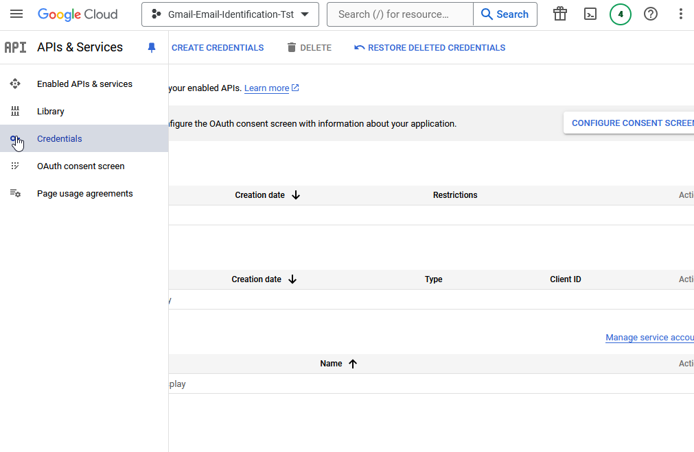
8. Click "CONFIGURE CONSENT SCREEN"
9. For User Type, select Internal
10. Fill out the App Name, User Support Email, App Logo, and Developer email. Click "Save and Continue 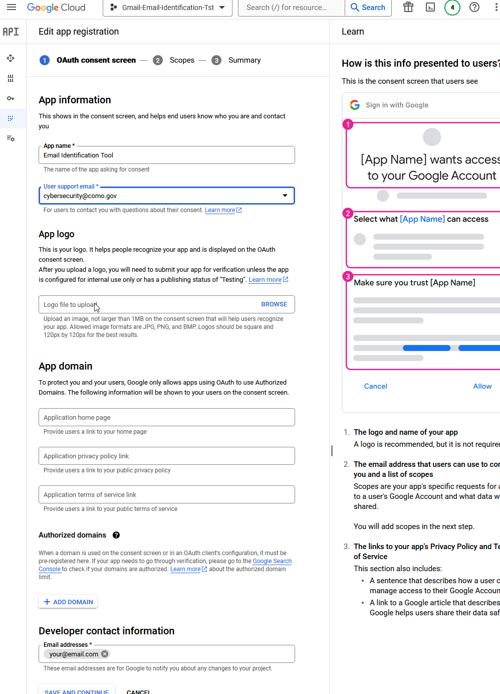
11. On your Scopes screen, click "Add or Remove Scopes" and select the following
    1.  https://mail.google.com/
    2.  /auth/gmail/modify
    3.  /auth/gmail/readonly
    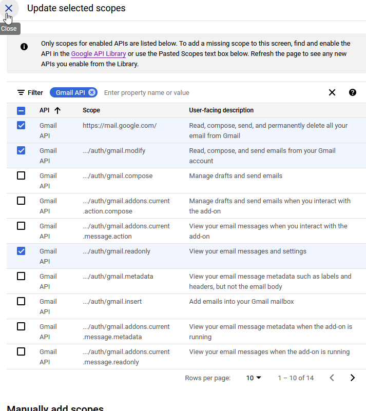
12. Click update, then save and continue
13. Review your summary, and if it looks correct, then select "Back to Dashboard"
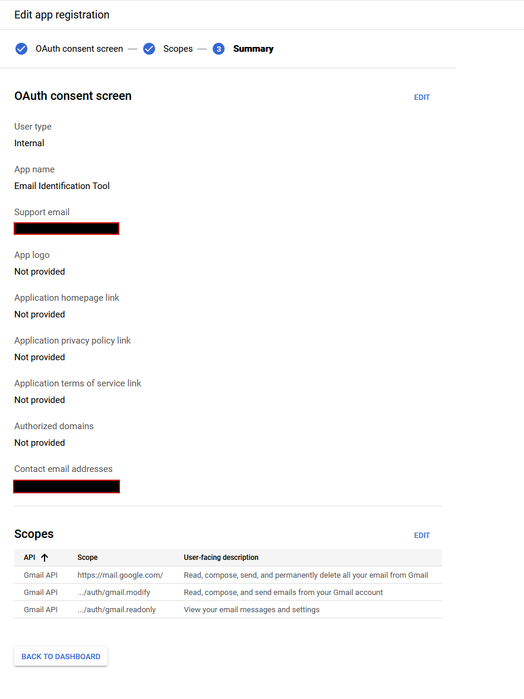
14.  Go back to APIs and Services

**Go back up to Step 8 in App Script Setup, then come back and finish Console Setup**

15.  Click the "Google Workspace Marketplace SDK"
16.  Select "App Configuration" 
       1.  For App Visibality, select Private
       2.  Installation Settings, Individual + Admin Install
       3.  App Integration
         1. select Google Workspace Add-On
         2. Deploy usering Apps Script deployment id
         3. Paste your Deployment ID from earlier
         4. Fill out your information for the Developer
         5. Hit SAVE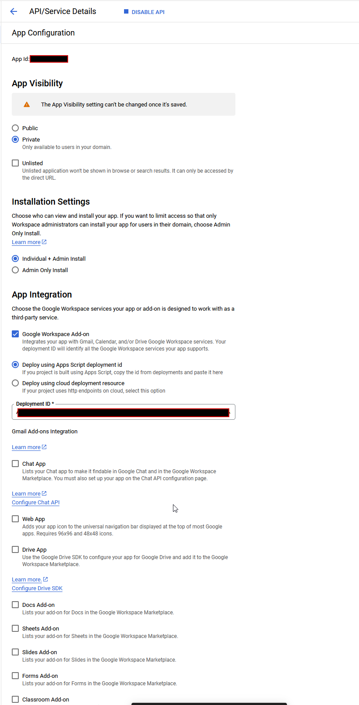
       4. OAuth Scopes
          - Fill out the following for the OAUTH Scopes
              * https://www.googleapis.com/auth/userinfo.email
              * https://www.googleapis.com/auth/userinfo.profile
              * https://www.googleapis.com/auth/script.external_request
              * https://mail.google.com/
              * https://www.googleapis.com/auth/gmail.modify
              * https://www.googleapis.com/auth/gmail.addons.current.message.action
              * https://www.googleapis.com/auth/gmail.addons.current.message.readonly
              * https://www.googleapis.com/auth/gmail.readonly
              * https://www.googleapis.com/auth/gmail.addons.execute
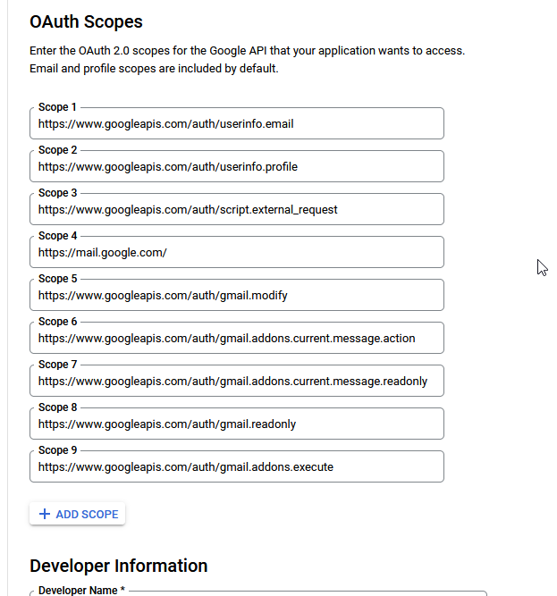
1.  Click on "Store Listing"
    1.  Under Edit Language, Fill in the Application Name and Descriptions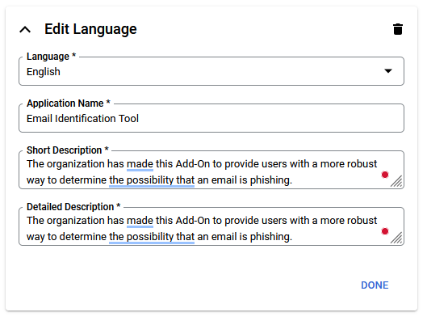
    2.  Select a Category
    3.  Upload an Application Icon
    4.  Upload a Screenshot
    5.  Fill in the ToS, Privacy Policy, and Support URL.
    6.  Select the Region
    7.  Click Publish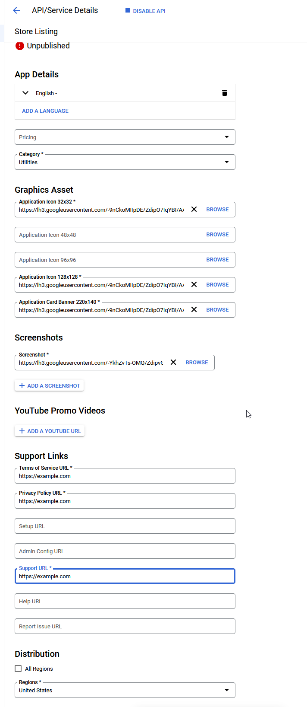

### Google Admin Center ***

1. Login to the [Google Admin center](https://admin.google.com)
2. In the left hand navigation bar, go to Apps, Google Workspace Marketplace Apps, App List
3. Select "Install App" 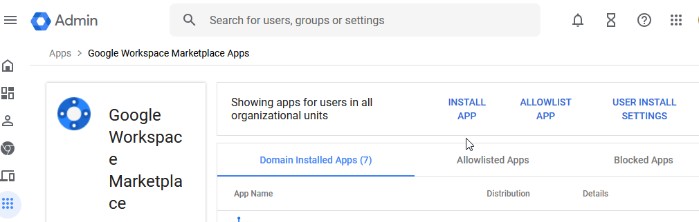
4. Select "Internal Apps" on the left hand menu, you should see your app listed
5. Click "Admin Install"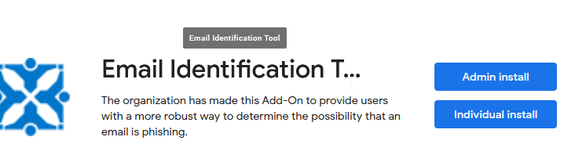
6. Click the Continue button on the warning message
7. Select "Certian groups or Organizational units" so we can test the deployment. 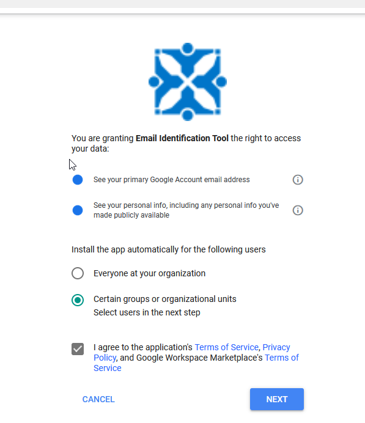
8. select the group to deploy the application to.
9. Select Finish

You will need to wait several minutes for the app to appear in your Gmail Add-ons. 

## HEC Connector Setup

If you are interested in setting up alerts for phishing emails that have been submitted or usage statistics, you can set up a HEC Connector. 

1. Set up your HEC Receiver on your SIEM.
2. You will need to take note of the HEC URL and Secret Key
3. Open the config.gs, and scroll to the bottom of the config to enter the following
   1. HEC_LOG_REPORTED_EMAIL = True;
   2. HEC_LOG_REPORTED_EMAIL_ENDPOINT = "https://example.com/path/";
   3. HEC_LOG_REPORTED_EMAIL_TOKEN = "Your_Secret_Key";
4. Open your AppScript.json and add the url to the URL Fetch Whitelist.

### To Do

- [X] Add Splunk Setup instructions -
  - [X] Setup HEC Connector
  - [X] Get the URL and Key
  - [X] Copy them into your Config File
  - [ ] Splunk Alerts?
- [X] Attachments sent to Logging Server
- [X] Restructure App to include the results in the log.
