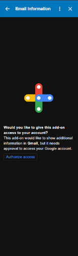
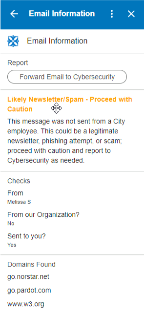
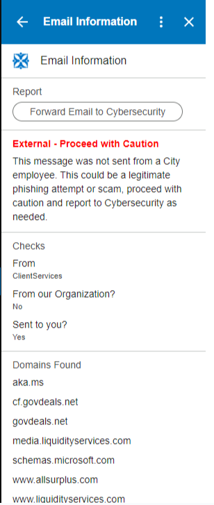
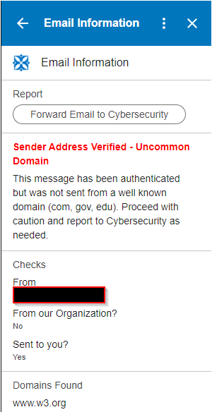
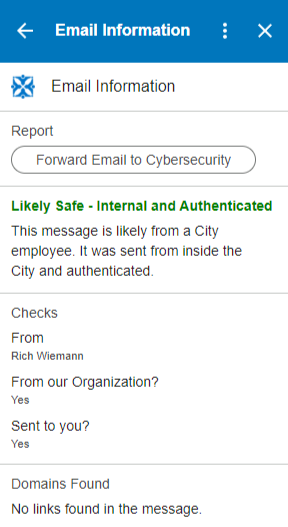
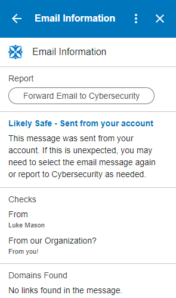
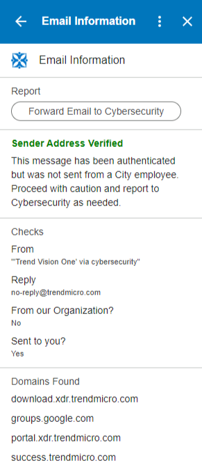
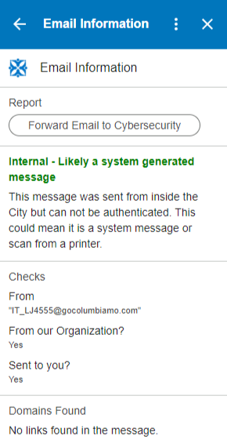

# Email Identification Messages

When using the Organization Email Identification Add-on, you may receive several messages, depending on the email and its content. This add-on is available with Gmail in the browser and on mobile.

This tool uses several hidden fields to identify email messages. Once the tool has parsed these fields, we make several decisions based on them. 

## Installation

The first time you use the add-on, you must Authorize Access for it to function. When you click the “Authorize Access” button, you will select your como.gov Google account and finally, “Allow.” This will give the add-on the appropriate permissions to read the hidden data in the emails.  

## Breakdown

1. Click on the icon in Gmail to open the Email Information Add-On.

2. This is the Information Area; depending on the email selected, different information will be displayed here. The text will change colors depending on our analysis of the content of the email.

3. This is the Check Area. Some information that you may see

1. From Address: This will display the From Address. This could differ from the email presented in the preview pane.  
2. Reply-To: If the email address for replies is different than the sender, it will be displayed
3. From the Organization? - This will inform you that the email was sent from an internal system or employee. 
4. Sent to you? - This will confirm if the email was sent to your “@organization” email address. If this says “No” you should be cautious to open the email. 

4. Domains Found: If there are Links in the email, they will be displayed here to make hovering easier, especially for Mobile Users.

5. If you have questions about the email, you can report it to Cybersecurity by clicking the button. This will remove the email from your inbox and forward it to your configured phishing Email.

## Color Examples

Green: This is most likely safe.

Yellow: This is likely Spam, proceed with caution.

Red: This is most likely bad, report to cybersecurity as necessary. 

Blue: This is either sent from your account or an internal phishing test. 

## Examples

### Likely Newsletter/Spam - Proceed with Caution 

**NOTES**: This message will be displayed if the email was not sent from an Organization Employee or system. This will also indicate that the sender's address couldn’t be verified so it could be very risky to open and click links or attachments. 

### External - Proceed with Caution 

### Sender Address Verified - Uncommon Domain

### Likely Safe - Internal and Authenticated 

**NOTES**: This message will be displayed if the email was sent from an Organization Employee or system. 

### Likely Safe - Sent from your account

**NOTES**: This message will be displayed if the email was sent from your account. This can also happen if you are using “Conversation View” with your inbox and you replied to the email already. You can select the email again to check the original email, not your reply. 

### Sender Address Verified 

**NOTES**: This message will be displayed if the email was not sent from an Organization Employee or system. This will also indicate that the sender's address has been verified. The email is from the address that was specified, however, it could be a hacked account.  \

### Internal - Likely a system generated message

**NOTES**: This message will be displayed if the email was sent from an Organization system or Printer.